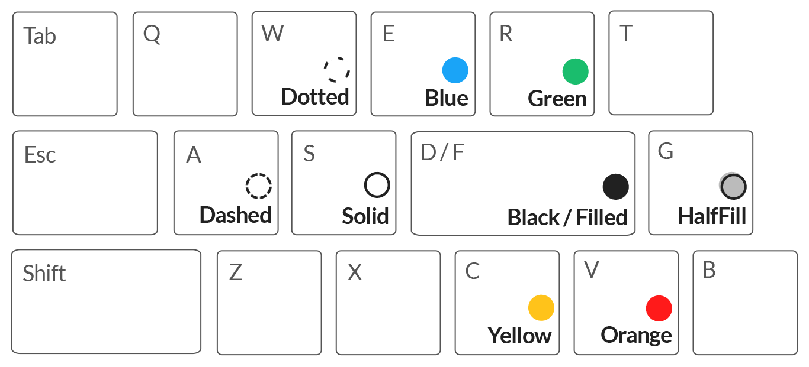

# qboard

*So you’re writing a whiteboard app with vim keybindings?*

**qboard** is a whiteboard app for seamless lecturing. It is sketchily hosted on [my website](https://cjquines.com/qboard/). It’s designed to be easy to use and nice to look at while sharing your screen. It should also be easy to share what you’ve written afterward as a PDF. This guides some of its principles:

- There are pages, rather than extending in different directions. It should feel like writing on multiple blackboards, and not an infinite sheet of paper.
- The pages are fixed at a 16:9 ratio, so when they’re later saved to a PDF, it’s in the same dimensions as a slideshow.
- It should be possible to do everything with the keys on one half of the keyboard, to make presentations flow smoothly. You shouldn’t need to move your mouse all the way to the left to change tools, or to move your hand to the right to switch to the pen tool.

Here are the default keybindings:

Image assumes Caps Lock is mapped to Escape. Tab cycles through three toolbar visibilities: the full toolbar, a status pane, and completely hidden. Shift snaps lines to multiples of 45°, and makes squares and circles. Q is not yet implemented. I’m not entirely satisfied with these bindings, and these might change.

There’s also these style bindings, which are chorded:

Pressing two or more of these keys applies the style. So for example, pressing A, E, and F at the same time makes the style dashed, blue, and filled. You can also press Space instead of pressing another key; so A and Space just turns the style into dashed without changing anything else. These chorded keys are less nice and I’m thinking about how to change them.

todo:
- change style of selected with chord? add to history too
- make toolbar show selected style, not pen style
- come up with better chords for styling
- something that pops up near your cursor when you press q ([as in this](https://medium.com/@subalerts/https-medium-com-implementing-custom-context-menu-in-react-js-part-1-b103260c724c))
- a better modal, probably
- tooltips for the toolbar
- rooms for spectating?
- rooms for collaboration?
- load prev/next pages in memory?
- make the eraser not use the bounding box?
- make move not use the bounding box?
- saving things to the server for a limited period?
