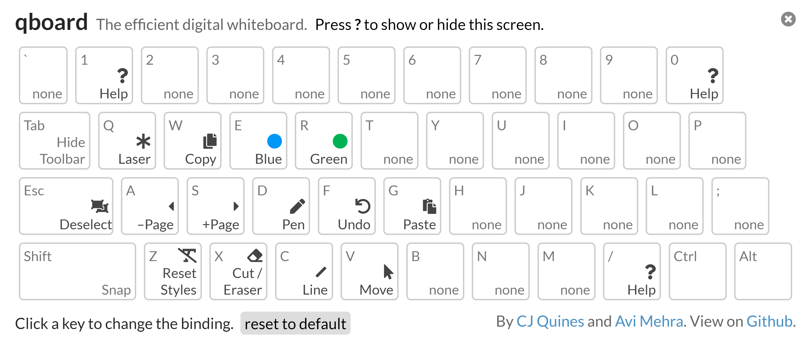

# qboard


_The efficient digital whiteboard._

**qboard** is a wholly client-side whiteboard app with efficient keyboard shortcuts, to make drawing feel as seamless as possible.
In the spirit of Vim, it's possible to do everything that isn't drawing without moving your hands.
It's hosted on [my website](https://cjquines.com/qboard/).
Here's a [demo video](https://youtu.be/8NvXHukL8ic).

## Features

Here are the default keybindings:



Tab cycles through three toolbar visibilities: the full toolbar, a status pane, and completely hidden.
Shift snaps lines to multiples of 45°, and makes squares and circles.

X is Cut when there's something selected, and Eraser when nothing is selected.
The Eraser is element level: it removes entire paths.
You can use X to delete whatever you have selected.
E or R, when already that color, resets it to black.

There are also keybindings with Shift and Ctrl, which you can view in-app.
Other neat things you can do:

- Hit the export button to save to a PDF.
  The save button exports to a JSON file, which you can later load back in to qboard.
- Use your browser's paste function (usually Ctrl+V or Cmd+V on Mac) to paste images from the system clipboard.
  You can also drag images onto the board, or use the file picker on the left side of the screen (labeled `Open`).
- Open your saved JSON files with the file picker to replace your current board with one from a file.
  Alternatively, drag and drop your saved JSON files;
  instead of overwriting your current board, this will insert the contents of the files into the board after the current page!
- Right-click to bring up a context menu to change the style.
- If you have a saved JSON file accessible via a URL, you can make a link that preloads the board with that file, like this one: <https://cjquines.com/qboard/?json=example.json>.

## Design principles

qboard is made for seamless lecturing.
It's designed to be easy to use and nice to look at while sharing your screen.
It should also be easy to share what you've written afterward as a PDF.
This guides some of its principles:

- It should be possible to do everything that isn't drawing just with keys.
  Ideally, only with the keys on one half of the keyboard, to make presentations flow smoothly.
  You shouldn't need to move your mouse all the way to the left to change tools, or to move your hand to the right to switch to the pen tool.
- It has pages, rather than extending in different directions.
  It should feel like writing on multiple blackboards, and not an infinite sheet of paper.
  - We are considering changing this to allow an infinite scroll mode (see [#6](https://github.com/cjquines/qboard/issues/6#issue-688305306)).
- Pages are fixed at a 16:9 ratio, so when that, in full-screen mode, most screens are perfectly filled by qboard.
  Additionally, when pages are later exported to a PDF, they have the same dimensions as a slideshow.

There are _some_ sense to the default keybindings:

- The three keys I use the most are on F, D, and S.
  A is assigned to make sense with S, and Shift + F to make sense with F.
- I tend to switch between colors and back while presenting, hence the E and R bindings.
- Imitating vim, X is like delete, which both cuts and erases.
- Ellipse and Rectangle start with E and R, while V is Move in Photoshop too.
- Q, A, and Z control stroke style, and W, S, and X control fill style.
  They form a column, going from "least" to "most".
- The Ctrl keybindings are pretty universal, except maybe D, for Duplicate.

Although initially designed for giving lectures, the whiteboard controls are pretty good.
I might add support for extending infinitely in several directions, in the style of a regular whiteboard app.

## Frequently asked questions

> My saved file won't open. Help!

There was a short period of time when we used a different file format for our JSON files.
It's very unlikely that you have such a file.
In case you do, you can make it compatible with the modern qboard app by taking the file and wrapping the contents like so:

```json
{
  "qboard-version": 1,
  "pages": OLD_FILE_CONTENTS_GO_HERE
}
```

If we have released a new file version beyond version 1, just opening any old files and saving them again will update them to the latest version.

## Implementation details

It's build on the [nwb](https://github.com/insin/nwb) toolkit, which handles React, Webpack, and Babel.
We're using Typescript.
The main app is mostly powered through [Fabric.js](http://fabricjs.com/), with [KeyboardJS](https://github.com/RobertWHurst/KeyboardJS) handling keybindings, and [pdfmake](http://pdfmake.org/#/) handling exporting to PDF.

We extend the Fabric canvas to a [Page class](src/lib/page.ts) with some convenience functions.
The [Pages class](src/lib/pages.ts) stores pages in a JSON array;
whenever we switch pages, we remove all the objects in the canvas and reload from memory.
In other words, we only store the live objects for the current page;
all other pages are stored serialized.
Boards are serialized to JSON just by collecting the serialized array, and adding a small amount of metadata to ensure compatibility.
A saved qboard file is thus entirely human-readable, though since it also stores paths, it may be unwieldy.

We also work with _two_ canvas elements.
The top canvas is a temporary one that renders lines, ellipses, and rectangles as they're being drawn, and after they're drawn, they're removed and added to the base canvas.
The base canvas handles everything else: the move tool, free drawing, the eraser, and so on; the top canvas is hidden for these operations.
This is for performance reasons, so the base canvas doesn't have to rerender every time the mouse moves on the top canvas.

The main source is [qboard.ts](src/lib/qboard.ts), which handles listening to mouse events and switching tools.
Everything else is delegated to handlers, which are in individual files:

- [action.ts](src/lib/action.ts), which abstracts the actions for the front-end.
- [clipboard.ts](src/lib/clipboard.ts), which handles cutting, copying, and pasting.
- [history.ts](src/lib/history.ts), which undoes and redoes with a pure(-ish) history stack.
- [keyboard.ts](src/lib/keyboard.ts), which catches keyboard events that aren't H.
- [styles.ts](src/lib/styles.ts), which gives an interface for changing pen style.
- [tools.ts](src/lib/tools.ts), which implements each non-free-drawing tool.

### Development

Running `npm start` will start a development server, which watches source files for changes.
Run `npm run build` to generate the static application files, suitable for hosting or offline use.
We have linters;
run the full suite with `npm run lint`, and automatically fix most warnings/errors with `npm run lint:fix`.
If you maintain a top-level `deploy.js` file, you can build the files and deploy in one step by running `npm run deploy`.
We also have a [Dockerfile](Dockerfile) which runs the development server in a container;
build the image with `docker build -t qboard .`, then run with `docker run -d --name qboard qboard`.
**Note that this server is not suitable for production use;
just host the static files instead.**

The FabricJS file is huge and it doesn't support tree shaking, so the [qboard demo at cjquines.com](https://cjquines.com/qboard/) uses a [custom build](http://fabricjs.com/build/).
It includes gestures, animation, free drawing, interaction, serialization, fabric.Rect, fabric.Ellipse, fabric.Image, fabric.Line, and window.fabric, which I think is the absolute minimum needed for it to work.
(Do note that custom build currently [has issues](https://github.com/fabricjs/fabric.js/issues/6624), though.
If you encounter errors, you may wish to try [this demo](https://pihart.github.io/qboard), which uses the full build.)
